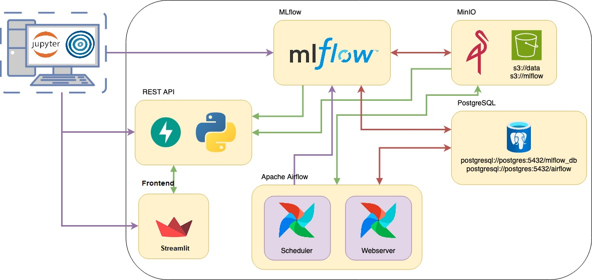

# Proyecto Final Aprendizaje de Máquina II - CEIA - FIUBA

### Integrantes:
- Kevin Cajachuán Arroyo
- Daniel Herrera
- Augusto Doffo
- Matías Marando
- Omar Lopez Cabrera


### Introducción
En este TP integrador de la materia Aprendizaje de Máquinas II implementamos el ciclo completo de MLOps, desde el preprocesamiento de los datos hasta el despliegue de un modelo de ML en producción.

El dataset utilizado es [Rain in Australia](https://www.kaggle.com/datasets/jsphyg/weather-dataset-rattle-package), el cual comprende aproximadamente 10 años de observaciones diarias del clima en numerosos lugares de Australia. El objetivo es predecir si lloverá o no al día siguiente en función de datos meteorológicos del día actual.

La implementación incluye:

- En Apache Airflow, un DAG que obtiene los datos del repositorio, realiza limpieza y
feature engineering, y guarda en el bucket `s3://data` los datos separados para entrenamiento
y pruebas. MLflow hace seguimiento de este procesamiento.
- Una notebook para ejecutar localmente con Optuna, que realiza una búsqueda de
hiperparámetros y encuentra el mejor modelo utilizando F1-score. Todo el experimento se
registra en MLflow, se generan gráficos de importancia de características, y además, se
registra el modelo en el registro de modelos de MLflow.
- Un servicio de API del modelo, que toma el artefacto de MLflow y lo expone para realizar
predicciones.
- En Apache Airflow, un DAG que, dado un nuevo conjunto de datos, reentrena el modelo. Se
compara este modelo con el mejor modelo (llamado `champion`), y si es mejor, se reemplaza. Todo
se lleva a cabo siendo registrado en MLflow.
- Una web API basada en Streamlit para interactuar fácilmente con el modelo.




### Pasos para probar el proyecto
- Clonar el [repositorio](https://github.com/Kajachuan/AMq2), utilizar el branch `main`
- En Linux o MacOS: sustituir en el archivo `.env` el `AIRFLOW_UID` por el ID de usuario correspondiente (`id -u <nombre_usuario>`)
- Ejecutar `docker compose` en el directorio raíz del repositorio: `docker compose --profile all up`
- En **Airflow** se verán dos DAGS:
    * `process_etl_rain_in_australia_data`
    * `retrain_the_model`
- Ejecutar el DAG `process_etl_rain_in_australia_data`, de esta manera se crearán los datos en el bucket `s3://data`
- Una vez finalizado, ejecutar la notebook `experiment_mlflow.ipynb`
- Opcionalmente, ejecutar el DAG `retrain_the_model`
- Verificar en **MLFlow** la creación del experimento y del modelo registrado
- Verificar los datos generados en MinIO
- Para probar el modelo:
    * Ejecutar la notebook `fastapi.ipynb` o
    * Ingresar al web server de **Streamlit**
        * En la página *Dashboard*, en la pestaña *Predicciones*, ingresar los datos y hacer una predicción de lluvia
- Para detener `docker compose` y eliminar todas las imágenes: `docker compose down --rmi all --volumes`


### URLs de los servicios
- Apache Airflow: http://localhost:8080
- MLflow: http://localhost:5000
- MinIO: http://localhost:9001
- FastAPI: http://localhost:8800/
- Documentación de la API: http://localhost:8800/docs
- Streamlit: http://localhost:8501/

Para verificar el estado de los servicios ejecutar `docker -ps a`:

```
CONTAINER ID   IMAGE                      STATUS                          PORTS                                         NAMES
25c4b6c32ec8   streamlit_app              Up 2 minutes (healthy)          0.0.0.0:8501->8501/tcp, :::8501->8501/tcp     streamlit_app
ff8435af8e0a   backend_fastapi            Up 2 minutes (healthy)          0.0.0.0:8800->8800/tcp, :::8800->8800/tcp     fastapi
1f87c84bfefb   extending_airflow:latest   Up 2 minutes (healthy)          8080/tcp                                      airflow_scheduler
0529803ae5b7   extending_airflow:latest   Up 2 minutes (healthy)          0.0.0.0:8080->8080/tcp, :::8080->8080/tcp     airflow_webserver
d0561c825747   mlflow                     Up 2 minutes (healthy)          0.0.0.0:5000->5000/tcp, :::5000->5000/tcp     mlflow
6e7efae2b44d   postgres_system            Up 2 minutes (healthy)          0.0.0.0:5432->5432/tcp, :::5432->5432/tcp     postgres
063adf9ccb41   minio/minio:latest         Up 2 minutes (healthy)          0.0.0.0:9000-9001->9000-9001/tcp              minio
```


### Descripción de los DAGs
1. `process_etl_rain_in_australia_data` (`dags/etl_process.py`)
    - Este DAG gestiona la carga de datos, transformaciones, división del conjunto de datos entrenamiento y validación, y la normalización de los datos.
    - Se ejecuta el primer día de cada mes a las 00:00 horas.

2. `train_model_rain_australia` (`dags/retrain_model.py`)
    - Este DAG realiza el reentrenamiento del modelo basado en uno previamente cargado en MLflow. Si las métricas del nuevo modelo superan las del modelo existente, este se actualiza, se etiqueta como "champion" y se desmarca el anterior.
    - Se ejecuta el primer día de cada mes a la 02:00 horas, dos horas después del otro DAG.
